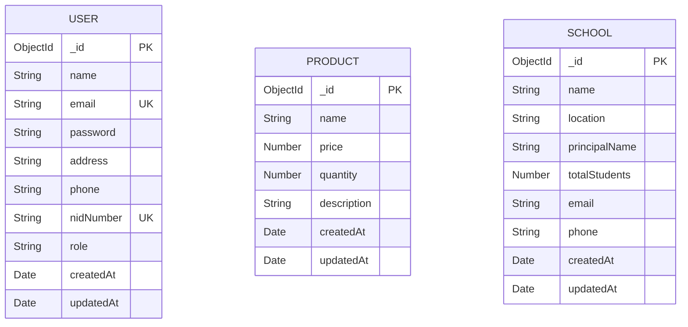

# 🗄️ Database Architecture & Schemas

Database Name: `mern_15day_course`

---

## 1. Entity Relationship Diagram (ERD)



---

## 2. Model Schemas

### `User` Collection Schema
```javascript
{
  name: { type: String, required: true, trim: true },
  email: { type: String, required: true, unique: true, lowercase: true },
  password: { type: String, required: true, select: false },
  address: { type: String, required: true, trim: true },
  phone: { type: String, required: true, trim: true },
  nidNumber: { type: String, unique: true, sparse: true },
  role: { type: String, enum: ['user', 'admin'], default: 'user' }
}
```

### `Product` Collection Schema
```javascript
{
  name: { type: String, required: true, trim: true },
  price: { type: Number, required: true, min: 0 },
  quantity: { type: Number, required: true, min: 0, default: 0 },
  description: { type: String, default: '' }
}
```

### `School` Collection Schema
```javascript
{
  name: { type: String, required: true, trim: true },
  location: { type: String, required: true, trim: true },
  principalName: { type: String, required: true, trim: true },
  totalStudents: { type: Number, required: true, min: 0 },
  email: { type: String, required: true, lowercase: true },
  phone: { type: String, required: true, trim: true }
}
```

---

## 3. NID Upsert Strategy

When an existing NID (`nidNumber`) is submitted:
1. Search database for `User.findOne({ nidNumber })`.
2. If document exists, update user details via `save()` / `findOneAndUpdate()` rather than attempting an insert that triggers a `E11000 duplicate key error`.
3. If document does not exist, insert new user record.
